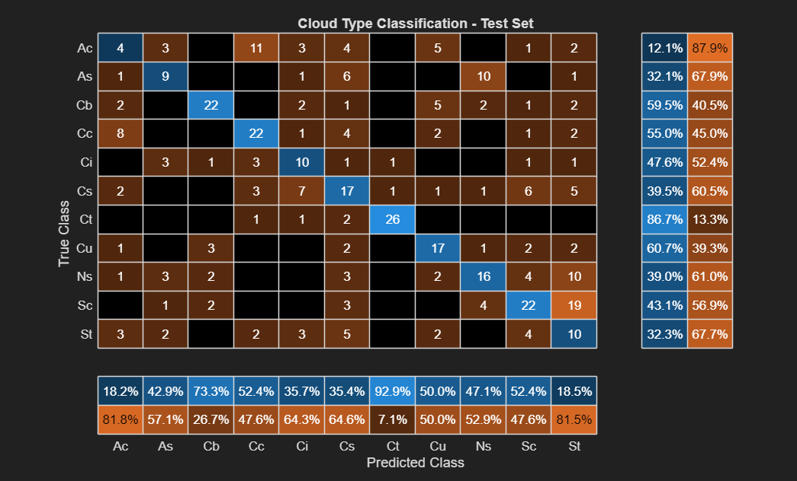
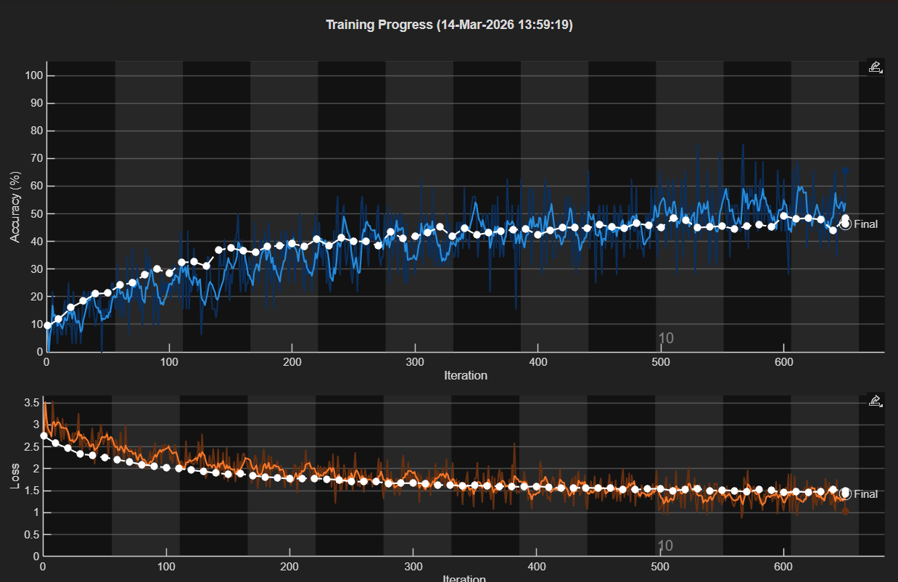
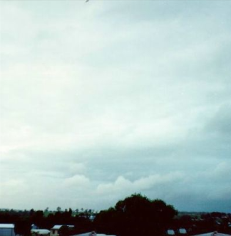
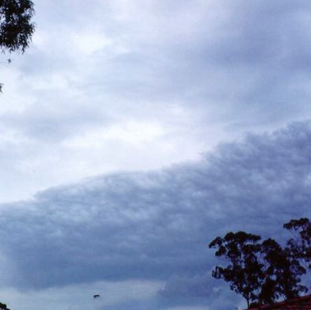
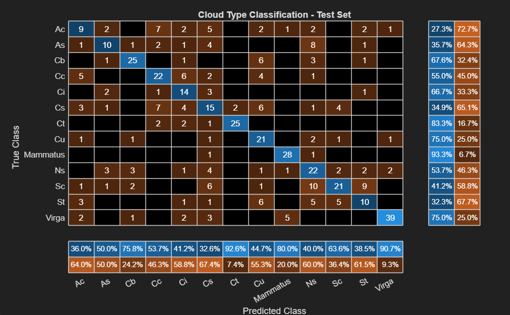
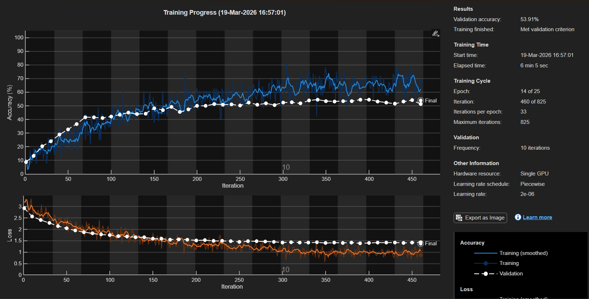

# MACHINE LEARNING PROJECT - CLOUD IDENTIFICATION

The central objective of this project is to develop and use a Machine Learning (ML) alrogithm to classify objects. This specific study uses MATLAB to classify 10 different types of clouds as defined by the World Meteorological Organization's genera-based classification, as well as an contrails.
Images for cloud classification are gathered from the Cirrus Cumulus Stratus Nimbus (CCSN) Database, which contains 2543 cloud images pre-labeled among the 11 classes.
Additionally, this project extends the CCSN dataset through the introduction of Mammatus and Virga cloud categories. The significance of these additions will be discussed later.
The study also aims to classify clouds for the purpose of severe weather threat analysis.

## Methods
### Overview
The ML algorithm uses MATLAB's Deep-Learning Toolbox to build a Convolutional Neural Network (CNN). 
This approach was chosen because of its built-in image processing capabilities. 
The CCSN data set does not contain pre-processed image characteristics like density, sharpness, contrast, etc. that could be used to identify clouds. 
To avoid pre-processing images then formatting data into a table, a CNN allows raw images to be interpreted by filters.
This systems allows characteristics like contrast or edge sharpness to be interpreted by the program and tied to different classes of clouds.
Notably, using the ResNet-50 image processing framework, many of these high layer filters like edge sharpness are pre-defined so even with small data sets like the CCSN, relatively high levels of accuracy can be achieved that would otherwise take thousands of images to train on.
The major disadvantage of this strategy is that many of these layers are abstract to us as humans.
When discussing "edge sharpness" of a cloud, the filters that the CNN uses might relate the brightness or contrast of neighboring pixels either vertically or horizontally or both. 
These filters are not human-defined, they are learned by the model, so the "feature importance" that we can define as humans has little relevance to the CNN.
Another way to interpret this is that there is no "contrast" or "edge sharpness" dial that we can turn to modify the class of the could.
We also cannot measure these directly through the CNN.

### Program Characteristics

The main training algorithm takes JPEG images (265 x 265 pixels) from the CCSN dataset and splits them randomly into training (70%), validation (15%), and testing (15%) categories. 
The major parameter that can be altered to adjust machine learning fit is the learning rate. The learning rate for this program was set to 1e-5, a reduction from the initial 1e-4 learning rate.
This change was made to reduce overfitting.
The confusion matrix and the learning progression are shown below. 

Although the final iteration was only about 49% accurate, the confusion matrix reveals that the majority of the errors are concentrated between certain clouds. 
For example, 19 Stratus (st) clouds were identified as Strato-cumulus (sc) clouds. 
These clouds are extremely visually similar as both are low atmospheric sheets of clouds resembling grey sheets.
This type of error is reasonable and crucially not conducive to major changes in the threat that these clouds pose meterologically.
Along with looking similar, both types of clouds are associated with slight rain or drizzle and relatively moderate weather.
For the purposes of identifying clouds to assess their meteorological threat, concentrated error is better than a random spread.
It is also notable that training data can cluttered by noise.
A quick google search for both altocumulus and stratocumulus clouds shows the identical image on different sites claiming that they are different clouds.
It should be obvious then, that the accuracy of the model is limmited by the accuracy of the data. 
Poor training data as well as a small datasets are likely the main reasons that the model plateus accuracy.

 

This first iteration of the model is able to identify clouds based on highly distincive visual features. 
Contrails (ct) for example, have the highest validation accuracy at 86.7%, and are easily distinguishable by their thin, straight apprearance.
The greater consistency in the visual appearane of contrails contributes to greater model accuracy in identification. 
Similarly, cumulus (cu) and cumulonimbus (cb) also have relatively higher degrees of accuracy compared to other classes of clouds.
The sharp, bubbly edges that define cumulus clouds are visually apparent, and here again model accuracy is benefitted by visual distinction of clouds. 

### Virga, Mammatus, and CCSN Dataset Extensions

The main training algorithm identifies 11 types of clouds including contrails, but lacks specific cloud types.
In addition to identifying these 11 categories of clouds, this study aims to add identification of Virga and Mammatus clouds individually.
Virga is a type of thin whispy cloud that can exist at several different elevations. 
It is commonly associated with high wind shear, and can act as a short term visual predictor of severe wind.
Similarly, Mammatus clouds are a specific feature of large cumulus and cumulonimbus clouds, which form as a result of cooling air.
Mammatus clouds indicate large amounts of precipitable mass and intense turbulence, also acting as short term warning for potential intense wind.

For this program to identify Virga and Mammatus, photos were collected from Wikimedia commons as well as from my camera roll. 
To have images in the same format as the CCSN dataset and thus suitable for the model to train on, an separate algorithm was created to process images and convert them into 256 x 256 JPEG format.
Additionally, landscape style images were separated into two halves to increase the number of distinct images available for training. 
Collectively, 342 Virga images and 197 Mammatus images were gathered and added to the CCSN.

### Model Retraining with Virga and Mammatus

With the extended dataset containing 13 classes, the model was retrained.
A few parameters were tweaked including the learning rate and the validation criteria in hopes of improving model accuracy. 
Ultimately, the only changes to the traning program were increasing the learning rate to 2e-5 and increasing the validation criteria from six trials without improvement to seven.
The retrained model showed similar results, with a slight increase in validation accuracy to 56.13%.

 

The confusion matrix shows the same error trends in the extended dataset as in the original.
For example, the model incorrectly identified altostratus as nimbostratus eight out of 28 times (29%).
Meteoroligically and visually however, these clouds are very similar to one another, with nimbostratus clouds forming as a result of a thickening altostratus cloud, both with a grey featureless appearance.
Training accuracy again is limmited by the lack of clear distinction between cloud types in this model.
